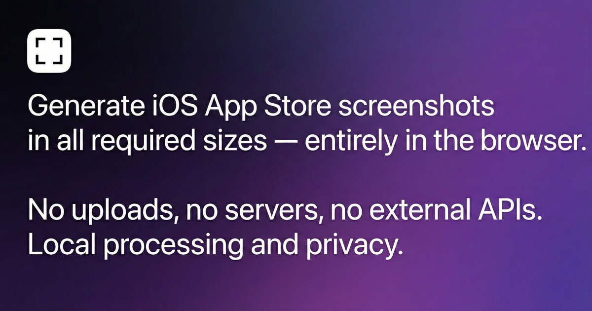
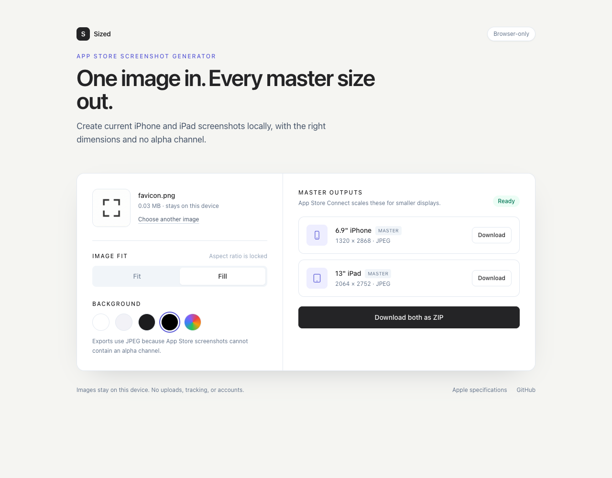

# Sized

[](https://github.com/YiftachCohen/sized/actions/workflows/lint.yml)
[](LICENSE)



Create current iPhone and iPad App Store screenshots entirely in the browser. No uploads, accounts, analytics, or external APIs.

**[Open Sized →](https://ycstudios.dev/sized)**



## Why two outputs?

App Store Connect can scale a highest-resolution screenshot down for smaller display classes. Sized generates one current master for each iOS platform instead of producing a folder of redundant legacy sizes.

| Platform | Master display | Portrait | Landscape |
| --- | --- | --- | --- |
| iPhone | 6.9-inch | 1320 × 2868 | 2868 × 1320 |
| iPad | 13-inch | 2064 × 2752 | 2752 × 2064 |

These dimensions are accepted by Apple's current [screenshot specifications](https://developer.apple.com/help/app-store-connect/reference/app-information/screenshot-specifications/). Apps that do not support iPad can simply ignore the iPad output.

## Features

- Drag and drop, paste, or select PNG, JPEG, and WebP source images
- Automatically preserves portrait or landscape orientation
- Fit the complete source or fill and crop to the target frame
- Choose an opaque background color for letterboxed images
- Export individual submission-safe JPEGs or a single ZIP
- Rejects oversized files and decoded images before expensive processing
- Cancels stale work when settings change quickly
- Runs locally with no runtime network requests

Sized exports JPEG because App Store screenshots cannot contain alpha channels. It uses high-quality browser canvas scaling and processes targets sequentially to keep peak memory predictable.

## Development

Requires Node.js 22.12 or newer and pnpm 11.

```bash
git clone https://github.com/YiftachCohen/sized.git
cd sized
pnpm install --frozen-lockfile
pnpm dev
```

| Command | Description |
| --- | --- |
| `pnpm dev` | Start the Vite development server |
| `pnpm build` | Type-check and create a production build |
| `pnpm preview` | Preview the production build locally |
| `pnpm test` | Run the Vitest suite |
| `pnpm lint` | Run Biome formatting and lint checks |
| `pnpm lint:fix` | Apply safe Biome fixes |

## Tech stack

React, TypeScript, Vite, Tailwind CSS, Canvas API, and JSZip.

## License

[MIT](LICENSE)
